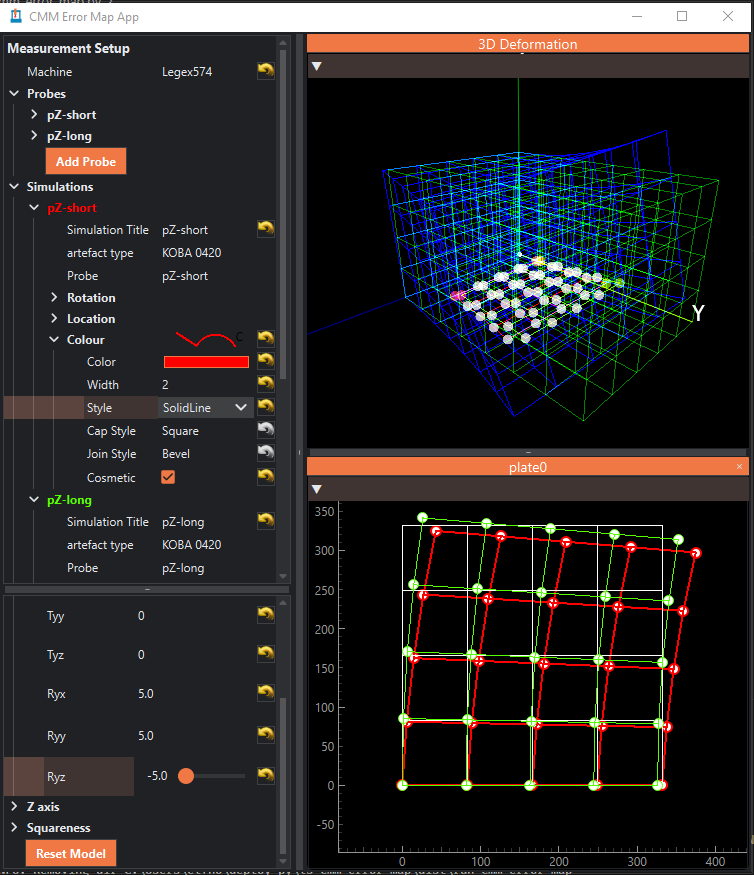
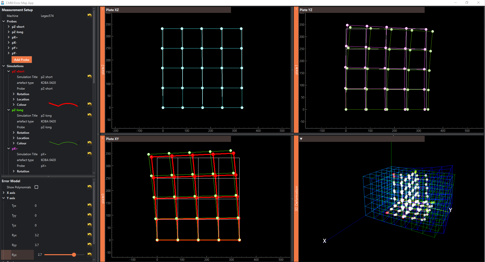
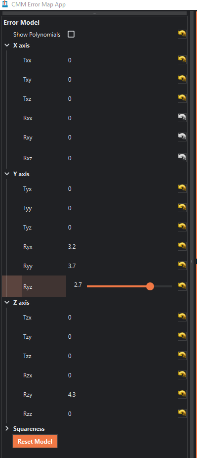

# cmm-error-map

An app to allow the user to adjust the 21 components of a CMM error map and visualise the effect each component or combination of components has on the overall measurement volume and on  measurements of specific artefacts (ball-plate and gauge block set).

This will help with using the ball-plate and gauge blocks to assess the CMM uncertainty.It could also  be used as a teaching tool.

## Progress

- 2025-02-13 released version "0.1.0-awaiti"

## Screenshots

## Deployment 

To create a new exe file run
`pyinstaller run_cmm_error_map.spec`

## Development

To work on the python code or run it directly set up an appropriate python environment and install the required dependencies.

Here's the method I'd use, if you know what you're doing do it your own way.

- have a MSL github login
- install [git](https://git-scm.com/)
- set your git [user name and email](https://docs.github.com/en/get-started/getting-started-with-git/setting-your-username-in-git)
- clone the repository `git clone https://github.com/MSLNZ/ls_cmm_error_map.git`  
- install [uv](https://docs.astral.sh/uv/), a Python package and project manager, 
- within  the  `ls_cmm_error_map` folder created by the `git clone` command run `uv sync`. This  will set up the correct python version and install all the required packages
- `uv run run_cmm_error_map.py` to run the app directly.
